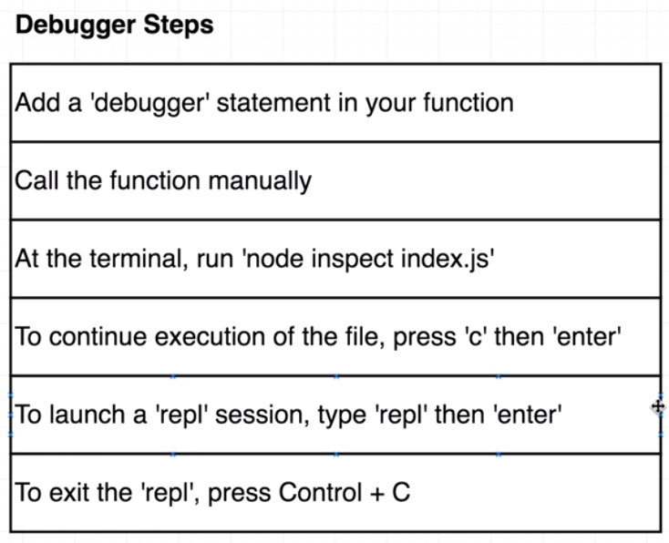

# AlgoCasts

## Before everything start

+ Check version of 'node', make sure it's later than v8.  
+ Install **_jest_** with npm.
```bash
AlgoCasts $ sudo npm Install -g jest
```

## How run the test with jest
```bash
AlgoCasts/exercise $ jest 'directory_you_want_run'/test.js --watch

만약 위의 명령어가 안되면

AlgoCasts/exercise $ jest 'directory_you_want_run' --watch
```

## How to Debug

##### 1. Pause execution inside of a function  
+ Add 'debugger' inside of a function
```js
function aaa() {
  debugger;
  return bbb;
}
```
+ Don't forget to call the function
```js
function aaa() {
  debugger;
  return bbb;
}

aaa('something');
```

+ Then, inside of specific directory, run the debugger with node
```bash
AlgoCasts/exercise/reversestring $ node inspect index.js 
```
+ Type c/cont to continue debug mode
(?? I'm not sure this is right.)

##### 2. Inspect some variable in a REPL mode  
+ In the debug more, type 'repl'
```bash
debug> repl
```
+ Then, type the variable you want to inspect
```bash
debug> repl
Press Ctrl + C to leave debug repl
> str
'asfd'
>
```
+ You can copy some codes, paste it there, too
```bash
> str.split('').reduce((rev, char) => char + rev, '');
'dfsa'
>
```
+ Exit the REPL mode, hit Ctrl + c
+ Exit the debug mode, hit Ctrl + c again



